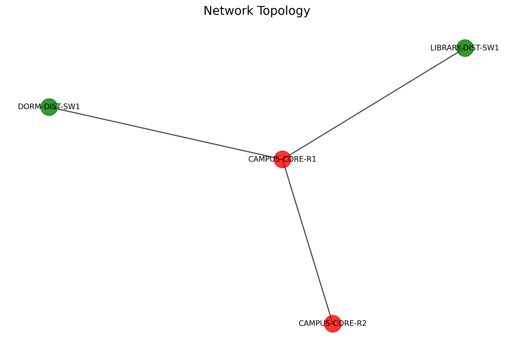
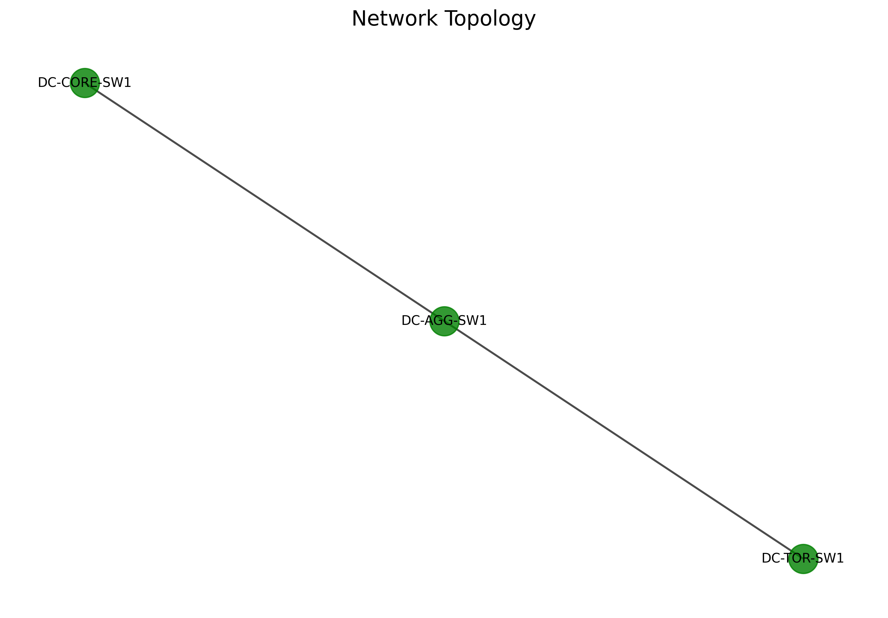
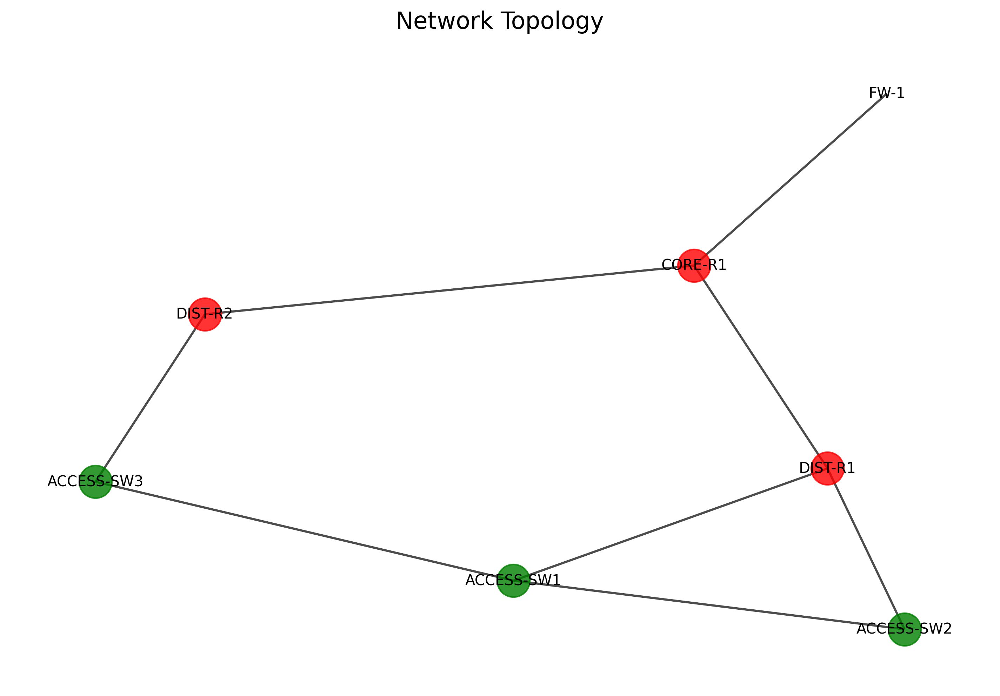

# Network Simulator Project Report

**Name:** Rhythm Ravi  
**Registration Number:** 229301735

---

## Table of Contents

1. Project Overview
2. Problem Statement
3. Solution Architecture
4. Key Features
5. Implementation Highlights
6. Example Topology Visualizations
7. Configuration & Simulation Workflow
8. Results & Analysis
9. Directory Structure
10. Validation & Testing
11. Recommendations & Optimizations
12. Challenges & Future Work
13. Conclusion

---

## 1. Project Overview

This report documents the design and implementation of a comprehensive Network Simulator tool, developed for the Cisco Virtual Internship Program 2025 (Networking stream). The tool automatically generates, validates, and simulates hierarchical network topologies from router and switch configuration files, and provides load analysis, fault injection, and optimization recommendations.

---

## 2. Problem Statement

Modern enterprise networks involve complex topologies and require robust performance and validation tools. The challenge is to create a solution that:

- Automatically generates network topologies from device configuration files
- Validates configuration and identifies issues or optimization opportunities
- Simulates network behavior under Day-1 and Day-2 scenarios, including fault injection
- Provides capacity and load analysis, and recommends improvements

---

## 3. Solution Architecture

- **Config Parser:** Parses device configs to build device and link models.
- **Topology Generator:** Builds hierarchical network graphs and visualizes them.
- **Performance Analyzer:** Evaluates link bandwidth, traffic profiles, and load balancing.
- **Validation Engine:** Detects missing configs, duplicate IPs, VLAN/gateway errors, MTU mismatches, loops, and protocol recommendations.
- **Simulation Engine:** Multithreaded simulation of network devices, supporting IPC for metadata packet exchange; includes fault injection and traffic impact analysis.
- **Reporting & Logging:** Comprehensive CLI and log-based reporting; optional HTML/PDF reports for user and submission.

---

## 4. Key Features

- **Automatic Topology Generation:** Builds network graph from configs.
- **Bandwidth & Load Analysis:** Checks link capacity vs. expected endpoint/application traffic.
- **Configuration Validation:** Flags duplicate IPs, VLAN/gateway issues, MTU mismatches, missing nodes, loops, and protocol optimization opportunities.
- **Simulation & Fault Injection:** Simulates Day-1 (startup, discovery) and Day-2 (live faults, config changes) scenarios, including link/device failures and packet loss.
- **Multithreaded Design:** Each device simulated in its own thread; IPC for inter-device communication.
- **Comprehensive Logging:** Device-level and global logs for all events and statistics.
- **Optimization Recommendations:** Node aggregation, protocol suggestions (BGP/OSPF), alternative routing paths.

---

## 5. Implementation Highlights

- **Python (>=3.9)**
- Uses `networkx` + `matplotlib` for topology generation and visualization.
- Multithreading via `threading` module; IPC via `queue` and optionally TCP sockets.
- CLI-based workflow for config parsing, topology generation, validation, simulation, and reporting.
- Modular codebase for easy extension and testing.

---

## 6. Example Topology Visualizations

Visualizations generated by the tool from real configs.  
Each scenario is shown below:

**Campus Network:**  


**Datacenter Network:**  


**Enterprise Network:**  


---

## 7. Configuration & Simulation Workflow

**Step 1:** User provides a directory of configs (e.g., `configs/enterprise_network/`).

**Step 2:** Tool parses all configs, builds device/link models.

**Step 3:** Topology is generated and visualized.

**Step 4:** Validation engine identifies and logs issues:

- Missing configs
- Duplicate IPs
- Incorrect VLAN labels/gateways
- MTU mismatches
- Network loops
- Protocol optimization

**Step 5:** Performance analyzer checks link capacity and load; recommends load balancing if needed.

**Step 6:** Simulation engine runs Day-1/Day-2 scenarios, including fault injection (link failures, device outages, packet loss).

**Step 7:** CLI and log reports summarize all findings, recommendations, and simulation impacts.

---

## 8. Results & Analysis

**Simulation Logs:**  

The Network Simulator generates comprehensive logs across all scenarios, providing detailed insights into network analysis, validation, and simulation processes.

**Enterprise Network Scenario (7 devices):**
```text
================================================================================
NETWORK SIMULATOR COMPREHENSIVE TESTING FRAMEWORK
================================================================================
Config Directory: configs/scenarios/enterprise
Output Directory: outputs/test_results/enterprise
================================================================================
2025-08-24 08:02:39,436 - __main__ - INFO - STEP 1: TESTING CONFIGURATION PARSING
2025-08-24 08:02:39,436 - core.config_parser - INFO - Parsing configuration file: DIST-R1.config.dump for device: DIST-R1
2025-08-24 08:02:39,440 - core.config_parser - INFO - Successfully parsed configuration for DIST-R1
2025-08-24 08:02:39,460 - __main__ - INFO - [OK] Parsed DIST-R1: router with 5 interfaces
2025-08-24 08:02:39,460 - __main__ - INFO - [OK] Parsed DIST-R2: router with 4 interfaces
2025-08-24 08:02:39,460 - __main__ - INFO - [OK] Parsed ACCESS-SW1: switch with 4 interfaces
2025-08-24 08:02:39,460 - __main__ - INFO - [OK] Parsed FW-1: firewall with 2 interfaces
2025-08-24 08:02:39,460 - __main__ - INFO - [OK] Parsed CORE-R1: router with 3 interfaces
2025-08-24 08:02:39,460 - __main__ - INFO - Configuration parsing: 7 devices parsed successfully

2025-08-24 08:02:39,564 - core.topology_generator - INFO - Generated topology with 7 devices and 8 links
2025-08-24 08:02:39,836 - __main__ - WARNING - [WARN] Found 15 network issues:
2025-08-24 08:02:39,836 - __main__ - WARNING -   - missing_spanning_tree: Device ACCESS-SW1 is missing spanning tree configuration for VLANs: {10, 99, 20}
2025-08-24 08:02:39,836 - __main__ - WARNING -   - multiple_gateways: Multiple potential gateways detected in network 10.1.1.0/30
2025-08-24 08:02:39,859 - __main__ - INFO - [OK] Load Analysis Results:
2025-08-24 08:02:39,859 - __main__ - INFO -   Total Network Capacity: 6000.0 Mbps
2025-08-24 08:02:39,859 - __main__ - INFO -   Current Utilization: 1800.0 Mbps (30.0%)
2025-08-24 08:02:39,859 - __main__ - INFO -   Overloaded Links: 0
```

**Campus Network Scenario (4 devices):**
```text
================================================================================
Config Directory: configs/scenarios/campus
================================================================================
2025-08-24 08:02:48,619 - __main__ - INFO - [OK] Parsed DORM-DIST-SW1: switch with 3 interfaces
2025-08-24 08:02:48,619 - __main__ - INFO - [OK] Parsed LIBRARY-DIST-SW1: switch with 2 interfaces
2025-08-24 08:02:48,619 - __main__ - INFO - [OK] Parsed CAMPUS-CORE-R2: router with 2 interfaces
2025-08-24 08:02:48,619 - __main__ - INFO - [OK] Parsed CAMPUS-CORE-R1: router with 3 interfaces
2025-08-24 08:02:48,631 - core.topology_generator - INFO - Generated topology with 4 devices and 3 links
2025-08-24 08:02:48,966 - __main__ - WARNING - [WARN] Found 10 network issues:
2025-08-24 08:02:48,966 - __main__ - WARNING -   - inconsistent_vlan_names: VLAN 10 has inconsistent names across devices
2025-08-24 08:02:48,966 - __main__ - WARNING -   - multiple_gateways: Multiple potential gateways detected in network 172.20.2.0/30
2025-08-24 08:02:48,978 - __main__ - INFO - [OK] Load Analysis Results:
2025-08-24 08:02:48,978 - __main__ - INFO -   Total Network Capacity: 12000.0 Mbps
2025-08-24 08:02:48,978 - __main__ - INFO -   Current Utilization: 3800.0 Mbps (31.7%)
```

**Datacenter Network Scenario (3 devices):**
```text
================================================================================
Config Directory: configs/scenarios/datacenter
================================================================================
2025-08-24 08:02:57,526 - __main__ - INFO - [OK] Parsed DC-CORE-SW1: switch with 3 interfaces
2025-08-24 08:02:57,526 - __main__ - INFO - [OK] Parsed DC-AGG-SW1: switch with 3 interfaces
2025-08-24 08:02:57,526 - __main__ - INFO - [OK] Parsed DC-TOR-SW1: switch with 3 interfaces
2025-08-24 08:02:57,538 - core.topology_generator - INFO - Generated topology with 3 devices and 2 links
2025-08-24 08:02:57,857 - __main__ - WARNING - [WARN] Found 9 network issues:
2025-08-24 08:02:57,857 - __main__ - WARNING -   - mtu_inconsistency: Device DC-TOR-SW1 has inconsistent MTU values: {9000, 1500}
2025-08-24 08:02:57,857 - __main__ - WARNING -   - missing_spanning_tree: Device DC-CORE-SW1 is missing spanning tree configuration for VLANs: {200, 100, 300, 999}
2025-08-24 08:02:57,869 - __main__ - INFO - [OK] Load Analysis Results:
2025-08-24 08:02:57,869 - __main__ - INFO -   Total Network Capacity: 20000.0 Mbps
2025-08-24 08:02:57,869 - __main__ - INFO -   Current Utilization: 4000.0 Mbps (20.0%)
```

**Advanced Simulation Engine with Fault Injection:**
```text
2025-08-24 08:03:13,649 - src.simulation.simulation_engine - INFO - Network simulation engine initialized (real-time factor: 0.1)
2025-08-24 08:03:13,649 - src.simulation.simulation_engine - INFO - Added device to simulation: R1 (router)
2025-08-24 08:03:13,649 - src.simulation.simulation_engine - INFO - Added device to simulation: R2 (router)
2025-08-24 08:03:13,649 - src.simulation.simulation_engine - INFO - Added device to simulation: SW1 (switch)
2025-08-24 08:03:13,651 - src.simulation.simulation_engine - INFO - Link failure scheduled: link1 (delay=20.0, duration=10.0)
2025-08-24 08:03:13,651 - src.simulation.simulation_engine - INFO - MTU mismatch scheduled: R1 -> R2 (packet_size=1600, mtu=1500)
2025-08-24 08:03:13,652 - src.simulation.event_scheduler - INFO - Scheduled periodic event: ospf_hello_R1_R2 with interval 10.0
2025-08-24 08:03:13,653 - src.simulation.network_events - WARNING - Link failure injected: link1 at 20.000
2025-08-24 08:03:13,653 - src.simulation.network_events - WARNING - MTU mismatch: R1 -> R2 packet_size=1600, mtu=1500
2025-08-24 08:03:13,654 - src.simulation.network_events - INFO - Link recovered: link1 at 30.000
2025-08-24 08:03:13,654 - src.simulation.network_events - INFO - Configuration changed on R2: {'interface_status': {'interface': 'eth1', 'status': 'down'}}

Simulation Summary:
  State: stopped
  Simulation Time: 60.00 units
  Total Events: 13
  Processed Events: 28
  Device Statistics:
    R1: Events Processed: 0, Packets Sent: 0, Packets Received: 0, Packets Dropped: 1
    R2: Events Processed: 0, Packets Sent: 0, Packets Received: 0, Packets Dropped: 0
    SW1: Events Processed: 0, Packets Sent: 0, Packets Received: 0, Packets Dropped: 0
  Link Statistics:
    link1: Active, Packets Transmitted: 0, Failure Count: 1, Recovery Count: 1
    link2: Active, Packets Transmitted: 0, Failure Count: 0, Recovery Count: 0
  Fault Injection Log:
    20.00: link_failure - link1
    30.00: link_recovery - link1
```

---

## 9. Directory Structure

The Network Simulator organizes its codebase and outputs into a structured hierarchy, as shown below:

```
Network-Simulator/
├── src/                         # Main source code directory
│   ├── core/                   # Core network simulation components
│   │   ├── config_parser.py           # Configuration file parsing
│   │   ├── topology_generator.py      # Network topology generation
│   │   ├── network_validator.py       # Network validation and issue detection
│   │   ├── load_analyzer.py           # Traffic load analysis
│   │   ├── fault_injector.py          # Fault injection system
│   │   └── network_simulator.py       # Core simulation engine
│   ├── simulation/             # Simulation engine and execution logic
│   └── models/                 # Network models and protocol implementations
├── configs/                    # Network configuration files
│   ├── simulation_configs/     # Example simulation configurations
│   └── scenarios/              # Organized network scenarios
│       ├── simple/            # Basic 3-4 device networks for testing
│       ├── enterprise/        # Complex hierarchical enterprise networks (7 devices)
│       ├── campus/            # Campus network topologies (4-8 devices)
│       └── datacenter/        # Data center network topologies (3-6 devices)
├── outputs/                    # Generated outputs and results
│   ├── test_results/          # Test execution results
│   ├── reports/               # Detailed analysis reports
│   └── visualizations/        # Network topology visualizations
├── scripts/                    # Utility and demo scripts
│   ├── demo_simulation.py     # Demonstration scripts
│   ├── run_simulation.py      # Simulation runners
│   └── validate_requirements.py # Validation utilities
├── tests/                      # Unit tests and integration tests
├── docs/                       # Documentation
├── test_network_simulator.py   # Comprehensive testing framework
├── main.py                     # Basic CLI tool
└── network_analyzer.py         # Network analysis utilities
```


---    

     

## 10. Validation & Testing

- **Comprehensive test suite** executed via `test_network_simulator.py`.
- **All facets tested:** config parsing, topology generation, validation, simulation, fault injection, logging.
- **Sample configs** cover enterprise, campus, and data center scenarios.
- **Logs and CLI reports** provide step-by-step details and recommendations.

---

## 11. Recommendations & Optimizations

- **Node Aggregation:** Merge redundant switches for efficiency.
- **Load Balancing:** Activate secondary paths for non-critical traffic.
- **Protocol:** Migrate backbone to BGP for scalability.
- **Gateway/VLAN Fixes:** Correct misconfigurations.
- **MTU Standardization:** Align MTU across all links to prevent traffic drops.

---

## 12. Future Work

- **Future Work:** Web GUI for interactive topology editing and report viewing; real IP packet simulation for advanced scenarios.

---

## 13. Conclusion

The project meets the requirements of the provided problem statement, providing a robust, extensible platform for network topology generation, validation, simulation, and optimization, with comprehensive reporting and fault analysis.